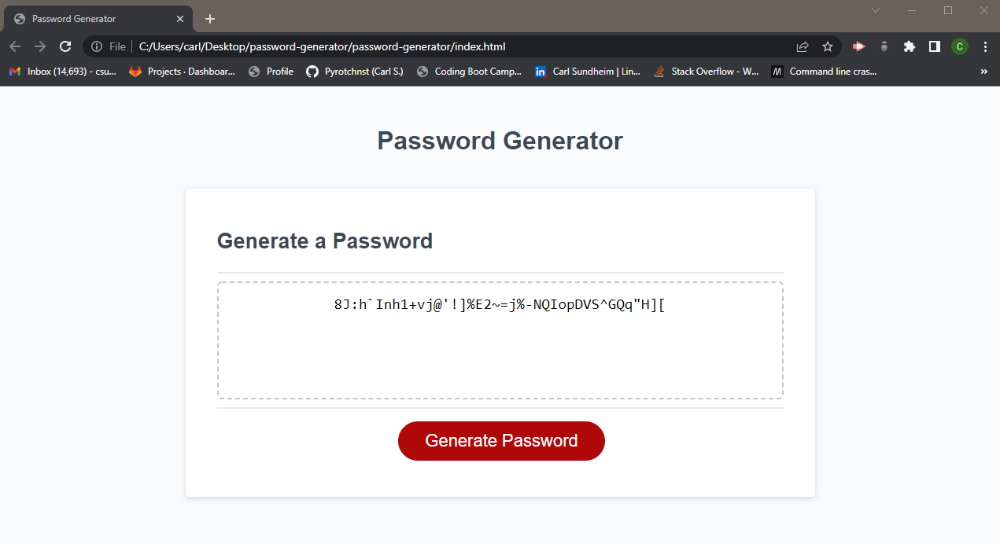

# Password generator

## Description

I designed a password generator as an assignment in understanding functions, if statements, for statements, and JS syntax.
This code generates a random password based on user input for desired length, and if it shall include a variety of characters.
I learned syntax and operation of numerous new comands in JS.

## Installation

This project can be opened as an HTML document to test functionality.

https://csundheimjr.github.io/password-generator/

The project code is availible in the supplied GITHUB repository.

https://github.com/csundheimjr/password-generator/

## Usage

Open the HTML file in the link above.
Select "Generate Password" and follow the promts to enter your user preferences.
Your randomly generated password will appear on the page.

    ```md
    
    ```

## Credits

The source code for the project was downloaded from bootcampspot.com
All code was writen by Carl Sundheim Jr Email: csundheim@gmail.com

## License

This code is not licensed.
